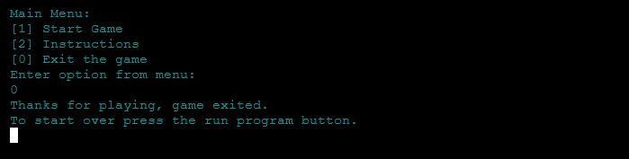

# PP3 - Python Essentials - Hangman

Hangman is an interactive python terminal word guessing game. Its target audience is students 15 years and above as well as adults. It's a fun and challenging game which helps improve spelling and problem-solving. Its purpose is to be an easily accessible and modern way to play a game that traditionally was only played using pen and paper. The game has 2 modes, easy and hard depending on how ambitious the player feels.

## Live Site

[Click here to play Hangman](https://jbachtiger-ci-pp3-hangman.herokuapp.com/)

## Table of Contents
- [User Experience (UX)](#user-experience)
  - [User Stories](#user-stories)

- [Design](#design)
  - [Colour Scheme](#colour-scheme)
  - [Flowchart](#flowchart)

- [Features](#features)
  - [Future Development](#future-development)

- [Data Model](#data-model)

- [Technologies Used](#technologies-used)
  - [Languages Used](#languages-used)
  - [Frameworks, Libaries and Programs Used](#frameworks-libraries-and-programs-used)

- [Testing](#testing)
  - [PEP8 Linter Results](#pep8-linter-results)
  - [Lighthouse Tool](#lighthouse-tool)
  - [Solved Bugs](#solved-bugs)
  - [Known Bugs](#known-bugs)

- [Deployment](#deployment)

- [Credits](#credits)
  - [Code](#code)
  - [Media](#media)
  - [Resources](#resources)
  - [Acknowledgments](#acknowledgments)

## User Experience
### User Stories
__Project Goals__
- To engage students and adults offering an interactive way to play a traditionally none digital game
- Teach players new words
- Improve players' problem-solving ability
- To be fun and make players want to play again
- To be programmatically error free
- To provide a varied selection of words and difficulty
- To handle all user input errors appropriately
- To provide clear instructions for valid inputs

__Business Owner Goals__
- As a site owner I want to create a fun and engaging game
- As a site owner I want to easily navigate my game and ensure it is user friendly
- As a site owner I want to have a clear menu showing start game, instructions and exit
- As a site owner I want it to be clear both visually and through text how many attempts/lives a player has left
- As a site owner I want there to be a choice of difficulty
- As a site owner I want the words in the game to be generated at random
- As a site owner I want consistent feedback to be provided if a user inputs invalid data
- As a site owner I want to allow the player to have an option to continue playing after each game has been finished

__First Time Visitor Goals__
- As a first-time visitor I want to be able to find out what type of game it is
- As a first-time visitor I want to be able to find clear instructions easily
- As a first-time visitor I want to be able to play the game quickly
- As a first-time visitor I want to have fun playing the game

 __Returning Visitors__
 - As a returning visitor I want to be able to play the game instantly

## Design
### Colour Scheme
- The colour scheme has been carefully chosen to ensure accessibility for all
- The colours compliment each other to ensure text is easily readable in the python terminal
- The colours used provide a fun, colourful and engaging interface
- The main colours used in the game are magenta, cyan, blue, green and red

### Flowchart

## Features 
- __Welcome Screen__
  - This includes the title of the game, with a brief tag line and a hangman image. This title and hangman image are created using ASCII art
  - The purpose of this section is the introduce the game in a visually appealing way that tells you about the game in as few words as possible which is why the accompanying image is also used

  

- __Enter Your Name__
  - The user is then prompted to input their name which once entered returns a welcome message and shows the menu
  - If the user enters an invalid input e.g. empty string an error message is returned
  - This section provides interactivity by taking the users name and providing a personalised welcome message by returning the name they have entered in the welcome message

  

  

- __Menu__
  - The menu has been created to be simple and direct the player to useful options
  - It informs the player what input returns each option
  - There are 3 choices, start game, instructions and exit which closes the programme
  - Validation has been put in place to provide feedback to the user if they input an invalid command

  

  

- __Instructions__
  - This section provides the player with a detialed list of instructions on how to play the hangman game
  - Its purpose is to help the player understand the game mechanics so they can get the most out of playing the game and enjoy their experience
  - There is a command to direct the user back to the main menu
  - Validation has also been added to provide feedback if invalid input is entered

  

  

- __Exit The Game__
  - The exit game option, exits the application and ends the game
  - To be able to start it again the run programme button needs to be entered
  - This provides the player with an option to leave the game should they desire
  - A thank you message is displayed if this option is chosen to thank the player for playing the game

 

 - __Start Game and Difficulty Option__
   - Once the start game option is entered, the player is asked what difficulty they wish to play
   - There are two levels, easy or hard which also has validation to feedback to the player if an incorrect command is entered
   - The difference in difficulty is the word length that will be returned, easy words have 4 letters where as hard words have upto 6 letters
   - Once the difficulty is chosen the main game starts
   - The way each step has been designed means that the player is directed for each stage of setting up the game and prompted with feedback if they make a mistake

- __Enter Your Guess__
  - Takes the players' letter guess input
  - If the input is correct then a correct letter message appears and the player is prompted to guess another letter
  - If the player is incorrect then an attempt is removed, a section of the hangman image appears and the player is prompted to guess again until all attempts have been used up
  - All letters that have been guessed are put into the used letters section
  - Validation has been put in place to provide feedback to the player if they try to enter an invalid input such as entering nothing, a number, multiple letters or a duplicated letter

  

  

  

  

  

  

- __Win Game__
  - Once all correct letters have been guessed, the player wins the game and a win game message appears
  - A play again option is then displayed, if the user plays again they will be asked for their difficulty and the game will start
  - If they choose to stop playing they will be returned to the main menu

  

- __Lose Game__
  - Once all guess attempts have been used up the hangman image appears, attempts left becomes 0, the correct word is shown and you lose message appears
  - A play again option is then displayed, if the user plays again they will be asked for their difficulty and the game will start
  - If they choose to stop playing they will be returned to the main menu

  

- __Validation__
  - Validation has been added throughout the game to provide players with feedback to prompt them when an incorrect/invalid input has been entered
  - They also give the player a hint as to why the error has occurred

- __Text Colours__
  - Colours have been used heavily in this game, this is to make it more interactive and engaging 
  - The colours also have meanings behind them such as green for correct answers and red for incorrect/invalid inputs
  - The purpose of these is to inform the player quickly what might be happening without even having to read all the text

- __Clear Terminal__
  - Function created to clear the terminal
  - Makes it easier for the user to see what's going on with the Hangman game by removing redundant output on new option selections

### Future Development
- Add a scoring system where players get points for each letter they get right, this would be achieved by adding a score variable and incrementing the score each time a letter is correct
- Create a leaderboard display for the players to display their high scores, this would be achieved by using a Google API to link to a Google Sheet where the player names and scores are stored

## Data Model

- The main game loop for my hangman game includes using two while loops, two if/else statements and a for loop within one of these if statements. 
- The first while loop allows the player to guess the letters until they have either run out of attempts or guessed the word. 
- The second while loop checks to make sure the letters aren't being duplicated and used more than once. 
- Then I have used an if statement to check the guess to see if the letter guessed is correct, if so it prints a statement telling the player they have correctly guessed the letter. If the letter is incorrect then it prints a statement telling the player the letter is incorrect and removes a life and shows another part of the hangman image. 
- The for loop within this if statement checks the letters within the word and updates it to reveal any correct letters as well as adding these letters to a new variable for the correctly guessed letters. This then displays the word with mixed letters and dashes depending on how many correct letters have been guessed and revealed. 
- The final if statement runs if all guesses have been used up, printing the full hangman image, corresponding text, attempts left 0, the correct word and the option to play again.

## Technologies Used
### Languages Used
- [Python](https://www.python.org/)

### Frameworks, Libraries and Programs Used

- [Gitpod](https://gitpod.io/projects) - this was my code editor for this project
- [Git](https://git-scm.com/) - was used for version control using the terminal through Gitpod to commit to Git and push to Github
- [Github](https://github.com/) - is used to store the code for this project after being pushed from Git
- [Techsini](http://techsini.com/multi-mockup/index.php) - was used to generate multi-device website mockups
- [Fireshot](https://chrome.google.com/webstore/detail/take-webpage-screenshots/mcbpblocgmgfnpjjppndjkmgjaogfceg?hl=en) - this was a Google Chrome extension used to take screenshots
- [PEP8 Online](http://pep8online.com/) - was used to validate python code to ensure no errors were present
- [Heroku](https://www.heroku.com/) - this was the platform used to deploy the application
- [Patorjk.com](https://patorjk.com/software/taag/#p=display&f=Rectangles&t=Welcome%20to%20Hangman) - ASCII code generator
- [Lucidchart](https://www.lucidchart.com/pages/) - this program was used to create the flowchart which maps out the logic for this hangman project
- Python Packages: 
  - [colorama](https://pypi.org/project/colorama/) >> This import allowed the terminal text to be printed in different colours

  - [os](https://docs.python.org/3/library/os.html) >> The os library was imported to create a function using os.name and os.system to clear the terminal. This library import provided a better user experience ensuring the terminal was clear after each guess and on returning to main menu

  - [random](https://docs.python.org/3/library/random.html?highlight=random#module-random) >> The random library was imported in order to access the functionality to generate a random word the from word.py file using the "random.choice()" method

  - [sys](https://docs.python.org/3/library/sys.html?highlight=sys#module-sys) >> The sys library was imported to use the sys.exit method to allow the user to exit the game

## Testing
This project has been manually tested by doing the following:
- Passed the code through the PEP8 linter and confirmed that there were no issues
- Tested all functionality of the game, that the terminal clears properly, ensuring all valid and invalid inputs work e.g. entering nothing, multiple inputs of the same letters, out of bound inputs
- Thorough manual testing in my local terminal and the Code Institute Heroku terminal

### PEP8 Linter Results
See below results for the PEP8 linter validation test. No syntax errors/warnings were found in the code.

### Lighthouse Tool

Lighthouse was used to test Performance, Best Practices, Accessibility and SEO on the Desktop. The results are within acceptable ranges.

### Solved Bugs
1. Indentation Errors - a couple of times throughout the project I was getting an indentation error due to my lines of code not following the correct indentation procedure. I fixed this by going through the problem code line by line ensuring all the code was following the correct indentation rules

2. Empty spaces, numbers and multiple letters counting as a guess - this issue was solved by amending and adding to the existing code in the take_guess_input function. The logic of the while loop was changed and exception errors were used to handle the input validation. Rather than using the isalpha() method the isdigit() method was used to ensure no numbers were inputted. The guess length code was kept the same but added into the elif statement rather than as the original while loop condition. [Link to commit](https://github.com/Jbachtiger/ci-pp3-hangman/commit/51ae5b9a8bd92f1ca2f6fcd43c713dcdafd9e43d)

3. Terminal not clearing correctly - my original clear terminal code wasn't fully clearing all of the outputs in my terminal, mainly the ASCII art welcome to text. After further investigation with a joint effort from Tutor Support and myself it was decided that the issue was probably to do with a peculiarity of the CI template that's required to run the terminal in Heroku. As a workaround, I amended the code in my clear_console function to an alternative method which seems to have done the trick. [Link to commit](https://github.com/Jbachtiger/ci-pp3-hangman/commit/3b503a5a6e594f664545679a09cb2c589de48ac5)

4. The menu text colour turning white when choosing not to play the game again - to fix this issues I added the colorama code Fore.CYAN directly to each of the menu print statements. [Link to commit](https://github.com/Jbachtiger/ci-pp3-hangman/commit/cd4d1edf1f2ea8583a8219058fd9e6762c672b0b)  

### Known Bugs
There are no known bugs left in this project.

## Deployment

This application has been deployed using Heroku by following these steps:

1. Commit all changes and push them to GitHub
2. Log in to [Heroku](https://www.heroku.com/) or create a new account
3. From the Heroku dashboard click the "Create New App" button
4. Enter the name of your app and the region you're located in. Then click "Create App". It is worth noting that your app name must be unique for Heroku to accept it
5. The next section is the deployment section for the app. Click on the "Settings" tab and scroll down to config vars
6. Click on "Reveals Config Vars" and add the KEY: CREDS and the VALUE stored in creds.json file if needed
7. Add the Config Var, KEY: PORT and VALUE: 8000
8. Next, go to the buildpacks section by scrolling down the page and click "Add Buildpack"
9. Select "Python" and click "Save Changes"
10. Repeat step 8, this time select "Nodejs" and click "Save Changes"
11. Please ensure your buildpacks have been selected in the above order, python on top and nodejs below
12. Go to the "Deploy" tab and scroll down to the "Deployment Method" section
13. Select "GitHub" as the method and click "Connect to GitHub"
14. Scroll down to the "Connet to GitHub" section and search for the depository name you wish to deploy. Do this by typing in the depository name and click the "Search button
15. Once the depository has been found, connect it by clicking the "Connect" button next to its name
16. Choose "Automatic deploys" or "Manual deploys" to deploy your application

## Credits
### Code
- [DelftStack](https://www.delftstack.com/howto/python/python-clear-console/) - this website provided the necessary information and code snippet to create a clear terminal function
- [MJ Codes](https://www.youtube.com/watch?v=wmSysRui0cI&ab_channel=MJCodes) - the base logic of the start_game() function was amended from this Youtube tutorial. The code has been extensively modified and extra features/components added to it

### Media
- The ASCII art code for the different hangman stages were taken from [here](https://github.com/mj-linane/cs4all-python-student-templates/blob/master/hangman-art.py)
- The ASCII header code uses the Rectangles font and was taken from [Patorjk.com](https://patorjk.com/software/taag/#p=display&f=Rectangles&t=Welcome%20to%20Hangman)

### Resources
- [Python.org](https://www.python.org/) - was used to broaden knowledge of the language and troubleshoot issues
- [PyPi.org](https://pypi.org/project/colorama/) - was used to understand how to use the colorama api to print coloured terminal text
- [StackOverflow](https://stackoverflow.com/) - was used to broaden knowledge to troubleshoot issues
- [Kylie Ying Youtube Tutorial](https://www.youtube.com/watch?v=8ext9G7xspg&t=1465s&ab_channel=freeCodeCamp.org) - this Youtube tutorial was used for inspiration and was part of my original research into Hangman games
- Code Institute Tutor Support - I used tutor support a couple of times to help me identify and resolve issues with my python code

### Acknowledgments
- My mentor for their support, advice and patience when reviewing this project with me
- My partner, for being so supportive and patient with me throughout this project and helping me test it

